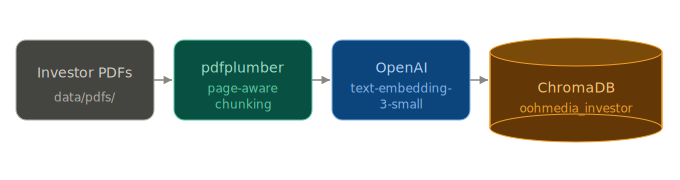
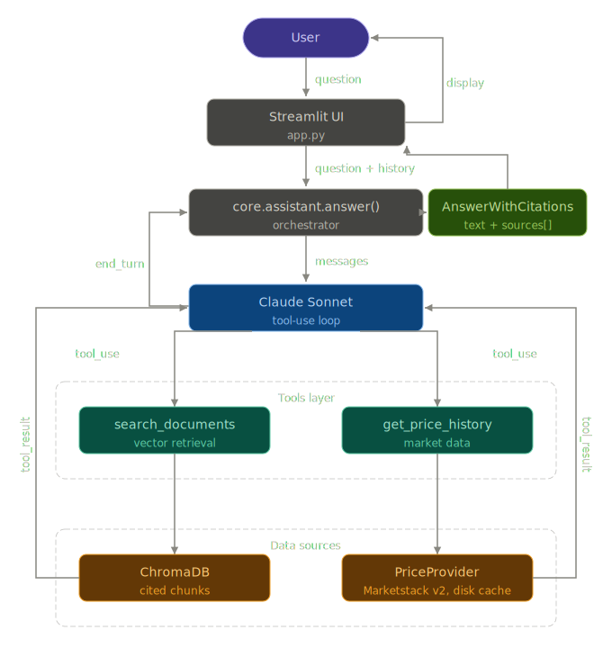

# Architecture - Investor Chat for oOh!media

Grounded in `Candidate_01_Candidate_Brief.docx`, `Candidate_02_Product_Requirements_Document.docx`, `Candidate_03_Product_Solution_Design.docx`, and `Candidate_04_User_Stories.docx`.

## Table of contents

- [Product in one line](#product-in-one-line)
- [Components](#components)
- [Data flow](#data-flow)
- [Locked stack](#locked-stack-one-line-rationale-each)
- [Out of scope](#out-of-scope-explicit)

## Product in one line

> "A chatbot that answers investor questions about oOh!media using the company's public investor materials and market data." - Candidate Brief

The assistant must be "a reusable capability, multiple surfaces, grounded answers" (Solution Design) exposed via a web chat **and** a second surface, with every substantive claim traceable to a source (PRD, NFR: Grounding).

## Components

The Solution Design names five capabilities; this architecture maps one-to-one:

| # | Component | Stories | Stack |
|---|-----------|---------|-------|
| 1 | **Chat interface** | US-01, FR-01 | Streamlit |
| 2 | **Knowledge layer** | US-02, FR-02 | pdfplumber + OpenAI embeddings + ChromaDB |
| 3 | **Market data** | US-04, FR-04 | Marketstack v2 behind `PriceProvider` interface |
| 4 | **Answer assembly** | US-03/05/06, FR-03/05/07 | Claude Sonnet tool-use via Anthropic API |
| 5 | **Reusable capability** | US-07, FR-06 | MCP stdio server (official Python SDK) *(not implemented)* |

**1 - Chat interface.** Streamlit web app with per-session history, token streaming, and visible error messages (no blank screens).

**2 - Knowledge layer.** oOh!media public PDFs parsed with pdfplumber, chunked with page-level provenance, embedded with `text-embedding-3-small`, and stored in ChromaDB.
- Covers at least two document types and two reporting periods (US-02 AC5)
- Re-running ingest adds new docs without a full rebuild (US-02 AC6)

**3 - Market data.** `PriceProvider` interface backed by Marketstack v2 (HTTPS, `OML.AX`). All responses cached to disk on first call. Providers can be swapped without touching `core/assistant.py`. See `DECISIONS.md`.

**4 - Answer assembly.** Single entry point: `core.assistant.answer(question, history)`.
- Calls Claude Sonnet with two tools: `search_documents` and `get_price_history`
- Sonnet decides which tool(s) to call; returns a structured `AnswerWithCitations`
- This is the one and only reasoning entry point in the system

**5 - Reusable capability.** MCP stdio server exposing one tool (`ask_oohmedia_investor_chat`) that calls `core.assistant.answer()` directly. No reasoning logic lives in the server - it is a thin adapter, making US-07 AC3 ("shared, not rebuilt") visibly true.

## Data flow

### Ingest (one-off, idempotent)

  

### Query (per question)

  

Both surfaces enter through the same `core.assistant.answer()` function. Neither surface talks to Anthropic, OpenAI, Chroma, or the market-data APIs directly.

## Locked stack (one-line rationale each)

| Layer | Choice | Rationale |
|---|---|---|
| Language / runtime | Python 3.11 + `uv` | Richest RAG ecosystem; `uv` gives sub-second env setup inside the 2h timebox. |
| PDF parsing | `pdfplumber` | Text-native oOh!media PDFs parse cleanly and pdfplumber gives page numbers for free, which US-03 AC4 needs. |
| Vector store | ChromaDB (persistent, local) | Single-directory embedded store, zero ops, satisfies "everything runs locally" (PRD non-goal on cloud). |
| Embeddings | OpenAI `text-embedding-3-small` | Cheap enough to re-embed the corpus freely; strong quality on financial prose. |
| Web UI | Streamlit | `st.chat_message` / `st.chat_input` / `st.write_stream` give US-01 in ~30 lines. |
| Second surface | Official MCP Python SDK (stdio) | Brief explicitly name-checks Claude Desktop (FR-06); MCP is the canonical fit. |
| Reasoning LLM | Anthropic Claude Sonnet (direct API, `ANTHROPIC_MODEL` env) | Native tool-use loop cleanly implements the US-05 router without a hand-rolled classifier. |
| Market data | Marketstack v2 (HTTPS, `OML.AX`) behind a `PriceProvider` interface | Free tier covers ASX. Interface allows provider swap without touching `core/assistant.py`. See `DECISIONS.md`. |
| Orchestration | `orchestrate.py` driving `claude -p` headless, per-story prompt files, per-story logs | Directly satisfies the brief's "programmatically drives AI coding agents through the backlog". |

## Out of scope (explicit)

Quoted from the PRD "Non-goals" and the Candidate Brief "Constraints":

- "Production visual design or enterprise SSO integration."
- "Ingesting non-public or internal company data." / "No non-public company information."
- "Providing financial advice, forward-looking statements, or trading capability."
- "Cloud deployment. Everything runs locally for this release."
- ASX announcements page ingestion is deferred - "this page loads content dynamically" (Solution Design), and US-02 AC5 only requires two document **types** and two periods, which annual reports + investor presentations satisfy.
- Full corpus ingestion - "It does not need to ingest the entire archive" (Solution Design).
- Authentication, multi-user sessions, persistent chat history across restarts.
