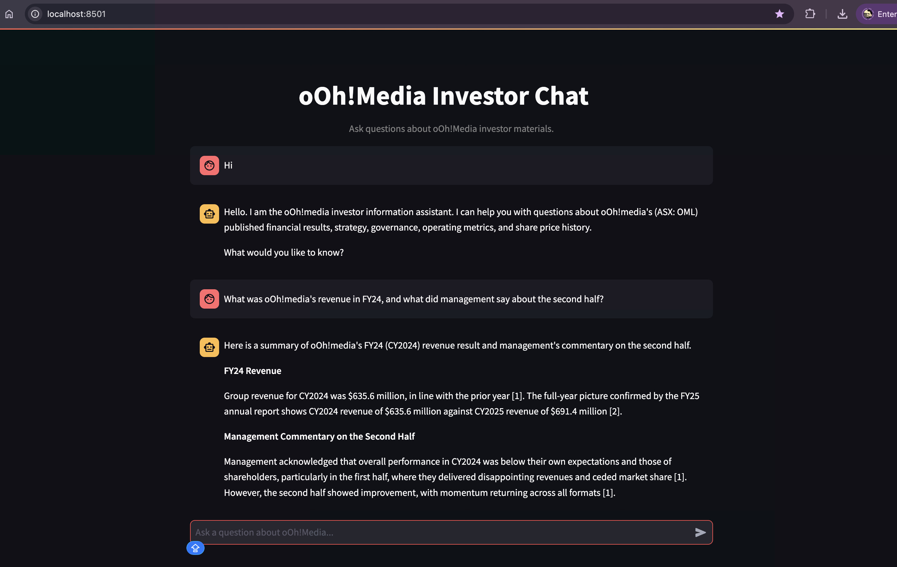
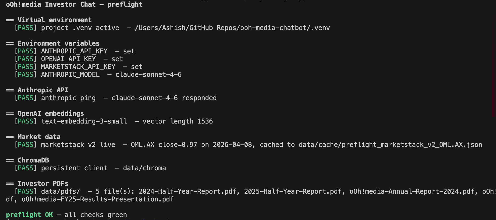
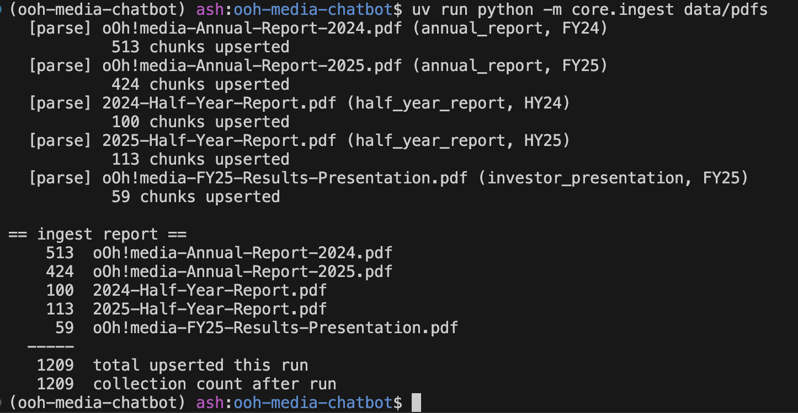

# oOh!Media Investor Chat

A grounded RAG chatbot that answers investor questions about oOh!media (ASX: OML) using the company's public investor materials and live market data. Every answer is traceable to a specific source document or data point - the assistant never fabricates citations and refuses out-of-scope questions explicitly.



## Table of contents

- [Architecture](#architecture)
- [Prerequisites](#prerequisites)
- [Clone-to-chat in four steps](#clone-to-chat-in-four-steps)
- [Sample questions](#sample-questions)
- [Corpus](#corpus)
- [Stack](#stack)
- [Project layout](#project-layout)
- [Running tests](#running-tests)
- [Orchestration (build-time only)](#orchestration-build-time-only)
- [Attributions](#attributions)

---

## Architecture

See [ARCHITECTURE.md](ARCHITECTURE.md) for the full design, data flow diagrams, and stack rationale.

---

## Prerequisites

| Tool | Version | Notes |
|---|---|---|
| Python | 3.11 | managed via `uv` |
| uv (Python package manager) | any recent | `curl -LsSf https://astral.sh/uv/install.sh \| sh` |
| Claude Code CLI | any recent | required only for `orchestrate.py` headless runs |

Three API keys are required - see step 1 below for details.

---

## Clone-to-chat in four steps

### 1 · Bootstrap

```bash
git clone https://github.com/ashishv-82/ooh-media-chatbot.git
cd ooh-media-chatbot
./scripts/bootstrap.sh   # installs uv if missing, runs uv sync, copies .env.example → .env
```

Edit `.env` and fill in your API keys before proceeding:

| Key | Required | Where to get it |
|---|---|---|
| `ANTHROPIC_API_KEY` | Yes | [console.anthropic.com](https://console.anthropic.com/) |
| `OPENAI_API_KEY` | Yes | [platform.openai.com](https://platform.openai.com/api-keys) |
| `MARKETSTACK_API_KEY` | Yes | [marketstack.com](https://marketstack.com/signup/free) (free tier) |

### 2 · Preflight

Validates every external dependency before touching the corpus or the API:

```bash
source .venv/bin/activate
uv run python scripts/preflight.py
```

Expected output - all green:



Non-zero exit if any required check fails.

### 3 · Ingest

Parse, chunk, embed, and store the corpus. Safe to re-run (idempotent):

```bash
uv run python -m core.ingest data/pdfs
```

Ingests 5 PDFs → 1,209 chunks into the `oohmedia_investor` ChromaDB collection at `data/chroma/`. Re-running the same corpus produces the same 1,209 chunks (no duplicates). See [data/pdfs/SOURCES.md](data/pdfs/SOURCES.md) for the full corpus manifest.



### 4 · Launch

```bash
source .venv/bin/activate
streamlit run app.py
```

Open [http://localhost:8501](http://localhost:8501). The chat is ready.

---

## Sample questions

**Grounded document answers**
- "What was oOh!media's revenue and EBITDA in FY24?"
- "What did management say about the Road segment in the HY25 results?"

**Market data**
- "What was the OML closing price on 28 February 2025?"
- "How did OML trade through March 2025?"

**Combined (the brief's showcase scenario)**
- "What did management say about revenue in the FY24 results, and how did the share price move in the following quarter?"

**Refusal cases (listed-company safeguards)**
- "Should I buy OML shares?" → refuses, explains financial-advice boundary
- "What did the board discuss at their last private meeting?" → refuses, cites non-public boundary
- "What's in the FY19 annual report?" → explains the document is not in the indexed corpus

---

## Corpus

Five PDFs sourced from the [oOh!media investor centre](https://investors.oohmedia.com.au/investor-centre/):

| Document | Type | Period |
|---|---|---|
| oOh!media Annual Report 2024 | annual_report | FY24 |
| oOh!media Annual Report 2025 | annual_report | FY25 |
| Half Year Report 2024 | half_year_report | HY24 |
| Half Year Report 2025 | half_year_report | HY25 |
| FY25 Results Presentation | investor_presentation | FY25 |

Covers three document types across four reporting periods - exceeds US-02 AC5's minimum.

---

## Stack

| Layer | Choice |
|---|---|
| Language | Python 3.11 + uv |
| PDF parsing | pdfplumber |
| Vector store | ChromaDB (persistent, local) |
| Embeddings | OpenAI text-embedding-3-small |
| Reasoning LLM | Anthropic Claude Sonnet (`claude-sonnet-4-6`) |
| Market data | Marketstack v2 / HTTPS / OML.AX |
| Web UI | Streamlit 1.40.2 |

No LangChain, LlamaIndex, FAISS, or FastAPI. See [DECISIONS.md](DECISIONS.md) for rationale on key choices.

---

## Project layout

```
.
├── app.py                  # Streamlit UI - imports only from core/
├── orchestrate.py          # headless build driver (claude -p per phase)
├── pyproject.toml          # pinned dependencies, managed by uv
├── uv.lock                 # lockfile
├── .env.example            # template for required API keys
├── core/
│   ├── __init__.py
│   ├── assistant.py        # answer(question, history) → AnswerWithCitations
│   ├── llm.py              # Anthropic client + system prompt + tool schemas
│   ├── retrieval.py        # ChromaDB search wrapper
│   ├── embeddings.py       # OpenAI text-embedding-3-small
│   ├── ingest.py           # pdfplumber → chunks → Chroma (idempotent)
│   ├── prices.py           # PriceProvider + Marketstack v2 impl
│   └── schema.py           # Citation, Chunk, AnswerWithCitations dataclasses
├── data/
│   ├── pdfs/               # 5 investor PDFs + SOURCES.md corpus manifest
│   ├── chroma/             # ChromaDB persistent store (gitignored)
│   └── cache/              # market-data JSON cache (gitignored)
├── tests/
│   ├── test_assistant.py
│   ├── test_ingest.py
│   ├── test_prices.py
│   └── test_retrieval.py
├── scripts/
│   ├── bootstrap.sh        # fresh-clone setup
│   ├── preflight.py        # dependency / API key validation
│   └── verify_us05.py      # live combined-answer verification harness
├── media/                  # screenshots used in README
├── logs/                   # per-phase run logs (gitignored)
├── backlog/                # US-01 … US-07 user story definitions
├── ARCHITECTURE.md
├── DECISIONS.md
├── IMPLEMENTATION-PLAN.md
└── LICENSE
```

---

## Running tests

```bash
source .venv/bin/activate
uv run pytest -q
```

27 tests across four suites (ingest, retrieval, prices, assistant). All mock the Anthropic, OpenAI, and Marketstack clients - no live API calls.

---

## Orchestration (build-time only)

> **Note:** This section documents how the project was built. You do not need to run `orchestrate.py` to use the chatbot - the four steps above are all you need.

`orchestrate.py` drove the build phases headlessly via `claude -p`:

```bash
uv run python orchestrate.py --list            # show all phases
uv run python orchestrate.py --phase US-03     # run one phase
uv run python orchestrate.py --phase US-03 --dry-run   # print prompt without running
```

Requires the Claude Code CLI on `PATH`. Logs land in `logs/<phase>_<ts>.log`.

---

## Attributions

No third-party templates or code scaffolds were used. The project was built from scratch using:

- [Anthropic Python SDK](https://github.com/anthropics/anthropic-sdk-python) (tool-use loop pattern from official docs)
- [ChromaDB docs](https://docs.trychroma.com/) (persistent client setup)
- [Streamlit docs](https://docs.streamlit.io/) (`st.chat_message` / `st.chat_input` API)
- [Marketstack API docs](https://marketstack.com/documentation) (v2 EOD endpoint)
